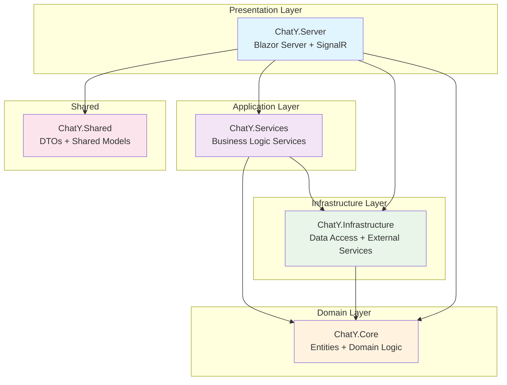

# ChatY - Modern Chat Application

A comprehensive, feature-rich chat application built with .NET 10, Blazor Server, SignalR, and Azure services.

## 🚀 Features

### Core Must-Have Features

#### Messaging Essentials

- ✅ Real-time messaging via SignalR WebSockets
- ✅ Typing indicators
- ✅ Read & delivered receipts
- ✅ Message reactions (emoji)
- ✅ Threaded replies
- ✅ Pinned messages
- ✅ Editing & deleting messages
- ✅ Rich media support (images, videos, voice notes, GIFs)
- ✅ File sharing (PDF, docs, etc.)
- ✅ Link previews

#### User System

- ✅ User profiles & status
- ✅ Online/offline/last seen
- ✅ Contact search
- ✅ Blocking & reporting

#### Security

- 🔄 End-to-end encryption (E2EE) for private chats (Azure Key Vault integration)
- 🔄 Encrypted backups
- 🔄 2FA / passkeys support
- 🔄 Zero-knowledge cloud sync

### Important / Should-Have Features

#### Chat Organization

- ✅ Folders for chats (Work, Personal, Favorite)
- ✅ Message search (full-text)
- ✅ Smart filters: Unread, Mentions, With files, With links

#### Voice & Video

- 🔄 Voice calls
- 🔄 Video calls (1-to-1 and small groups)
- 🔄 Screen sharing
- 🔄 Audio rooms (Clubhouse-style)
- 🔄 Blur background / virtual backgrounds

#### Groups

- ✅ Large group support (1k+)
- ✅ Admin tools (roles, permissions)
- 🔄 Join via link or QR code
- 🔄 Announcement channels

#### Cross-Device Experience

- ✅ Multi-device login
- ✅ Fast sync across devices
- ✅ Web version

### Modern 2025 Features (AI-Powered & UX Boosters)

#### AI, Automation & Smart Tools

- 🔄 AI summaries of long chats or missed messages
- 🔄 AI smart replies (contextual quick suggestions)
- 🔄 AI content creation in chat (rewrite, translate, expand)
- 🔄 Voice → text transcription automatically
- 🔄 Smart search (search meaning, not exact text)

#### AI Moderation

- 🔄 Automatic detection of harmful content
- 🔄 Spam/fake account prevention
- 🔄 Toxic message warnings

#### Smart Media

- 🔄 Auto-generated captions for videos
- 🔄 Auto-translated voice messages
- 🔄 AI-generated stickers / avatars

#### Productivity Add-Ons

- ✅ Shared tasks
- ✅ Polls
- 🔄 Event reminders inside groups
- 🔄 Collaborative notes

### Trust, Privacy & Compliance

- ✅ Local-only mode support (messages stay on device)
- ✅ Disappearing messages / auto-delete
- 🔄 Screenshot detection (optional)
- ✅ Granular privacy controls:
  - Who can message you
  - Who can add you to groups
  - Who sees your profile photo
- 🔄 GDPR / CCPA compliance
- 🔄 Transparency dashboards (data usage, device log-ins)

### UX / UI Expectations

- ✅ Dark/light mode (+ auto)
- 🔄 Custom themes
- 🔄 Custom chat backgrounds
- ✅ Message bookmarking
- 🔄 Personal cloud storage dashboard
- ✅ Reactions + stickers + emoji packs
- ✅ Smooth animations, haptics, "fun" interactions

### Admin & Monetization

- 🔄 User management
- 🔄 Community analytics
- 🔄 Moderation tools (delete, mute, restrict)
- 🔄 Premium subscription (themes, storage, AI features)
- 🔄 Paid stickers / avatars
- 🔄 Business API for companies

## 🏗️ Architecture

ChatY follows a **Clean Architecture** (also known as Onion Architecture) pattern, which promotes separation of concerns, testability, and maintainability. The architecture is divided into concentric layers, where outer layers depend on inner layers, but inner layers are independent of outer ones.

### Architecture Diagram



### Layer Responsibilities

#### Domain Layer (ChatY.Core)

The innermost layer containing the core business entities and domain logic. This layer has no dependencies on external frameworks or technologies.

- **Entities**: Core domain objects (User, Chat, Message, MessageReaction, ChatParticipant, etc.)
- **Value Objects**: PrivacySettings, MessageReceipt, etc.
- **Enums**: UserStatus, ChatType, MessageType, ParticipantRole, etc.
- **Domain Services**: Pure business logic without external dependencies

#### Infrastructure Layer (ChatY.Infrastructure)

Handles external concerns such as data persistence, file storage, and third-party services. Implements interfaces defined in the domain layer.

- **Data Access**: Entity Framework Core DbContext with full entity configurations
- **Repositories**: Generic repository pattern for data operations
- **External Services**: Azure Blob Storage, Azure Key Vault, Azure Identity
- **Configurations**: Database migrations, connection strings, service registrations

#### Application Layer (ChatY.Services)

Contains application-specific business logic and use cases. Orchestrates domain objects and infrastructure services.

- **ChatService**: Chat creation, participant management, archiving
- **MessageService**: Message operations (send, edit, delete, reactions, read receipts)
- **UserService**: User management, status updates, search functionality
- **Interfaces**: Service contracts for dependency injection

#### Presentation Layer (ChatY.Server)

The outermost layer responsible for user interaction and external communication. Built with Blazor Server for real-time web UI.

- **SignalR Hub**: Real-time WebSocket communication (ChatHub)
- **Blazor Components**: Reactive UI components for chat interface
- **Pages**: Razor pages for routing and navigation
- **Authentication**: ASP.NET Core Identity integration
- **Middleware**: Request handling, CORS, security policies

#### Shared Layer (ChatY.Shared)

Contains shared models, DTOs, and utilities used across multiple layers.

- **DTOs**: Data Transfer Objects for API communication
- **Shared Models**: Common types used by multiple projects
- **Constants**: Application-wide constants and enums

### Technology Stack

- **.NET 10** - Latest .NET framework with modern language features
- **Blazor Server** - Real-time web UI framework with server-side rendering
- **SignalR** - Real-time bidirectional communication over WebSockets
- **Entity Framework Core 10** - Modern ORM with LINQ support
- **SQL Server** - Primary relational database
- **Azure Blob Storage** - Scalable file and media storage
- **Azure Key Vault** - Secure key management for encryption
- **Azure Identity** - Unified authentication and authorization

### Key Design Principles

- **Dependency Inversion**: Higher-level modules don't depend on lower-level modules
- **Single Responsibility**: Each layer has a specific, well-defined purpose
- **Interface Segregation**: Clients depend only on methods they use
- **Testability**: Clean separation enables comprehensive unit and integration testing
- **Maintainability**: Changes in one layer don't affect others unnecessarily

## 📦 Getting Started

### Prerequisites

- .NET 10 SDK
- SQL Server (LocalDB or SQL Server Express)
- Azure account (for Azure services - optional for development)

### Installation

1. Clone the repository:

```bash
git clone <repository-url>
cd ChatY
```

2. Restore packages:

```bash
dotnet restore
```

3. Update connection strings in `appsettings.json`:

```json
{
  "ConnectionStrings": {
    "DefaultConnection": "Server=.;Database=ChatYDb;Trusted_Connection=True;MultipleActiveResultSets=true",
    "AzureStorage": "UseDevelopmentStorage=true"
  }
}
```

4. Run database migrations (or use EnsureCreated for development):

```bash
dotnet ef migrations add InitialCreate --project src/ChatY.Infrastructure --startup-project src/ChatY.Server
dotnet ef database update --project src/ChatY.Infrastructure --startup-project src/ChatY.Server
```

5. Run the application:

```bash
dotnet run --project src/ChatY.Server
```

6. Navigate to `https://localhost:5001` in your browser

## 🔧 Configuration

### Azure Services (Optional)

To use Azure services, update `appsettings.json`:

```json
{
  "ConnectionStrings": {
    "AzureStorage": "DefaultEndpointsProtocol=https;AccountName=...;AccountKey=..."
  },
  "Azure": {
    "KeyVault": {
      "Url": "https://your-keyvault.vault.azure.net/"
    }
  }
}
```

### Authentication

The application currently uses cookie authentication. For production, integrate with:

- Azure AD
- Identity Server
- ASP.NET Core Identity

## 📝 Development Roadmap

### Phase 1: Core Features (✅ Completed)

- [x] Project structure
- [x] Domain models
- [x] Database setup
- [x] Basic chat functionality
- [x] Real-time messaging
- [x] Message reactions
- [x] User management

### Phase 2: Enhanced Features (🔄 In Progress)

- [ ] File upload and media handling
- [ ] Voice and video calls
- [ ] Advanced search
- [ ] AI integration
- [ ] End-to-end encryption

### Phase 3: Advanced Features (⏳ Planned)

- [ ] Mobile app (MAUI)
- [ ] Desktop app
- [ ] Advanced analytics
- [ ] Monetization features
- [ ] Business API

## 🤝 Contributing

Contributions are welcome! Please feel free to submit a Pull Request.

## 📄 License

This project is licensed under the MIT License.

## 🙏 Acknowledgments

Built with modern .NET technologies and best practices for scalable, real-time chat applications.
