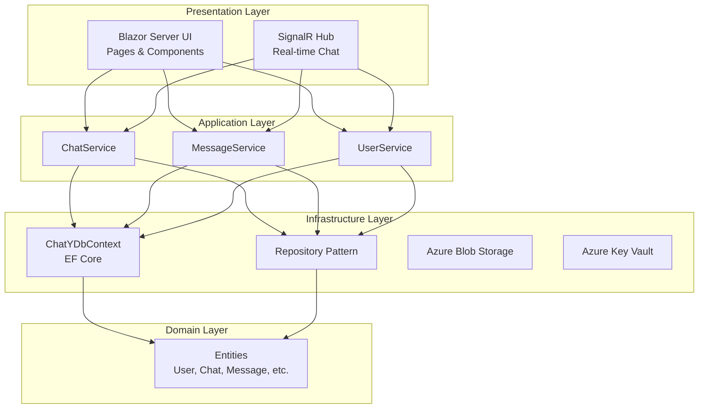

# Architecture Diagram

## Overview

The ChatY solution follows a layered architecture pattern, separating concerns into distinct layers for maintainability and scalability.

## Layers

- **Presentation Layer**: Handles user interface and real-time communication
- **Application Layer**: Contains business logic services
- **Infrastructure Layer**: Manages data access and external services
- **Domain Layer**: Defines core business entities and rules

## Diagram

## Description

The architecture is designed with clean separation of concerns:

- **Blazor Server UI** provides the web interface using Razor components.
- **SignalR Hub** enables real-time messaging and notifications.
- **Services** encapsulate business logic for chats, messages, and users.
- **Infrastructure** handles data persistence via Entity Framework Core and external integrations.
- **Domain Entities** represent the core business objects.

Dependencies flow inward, ensuring the domain layer remains independent and testable.
